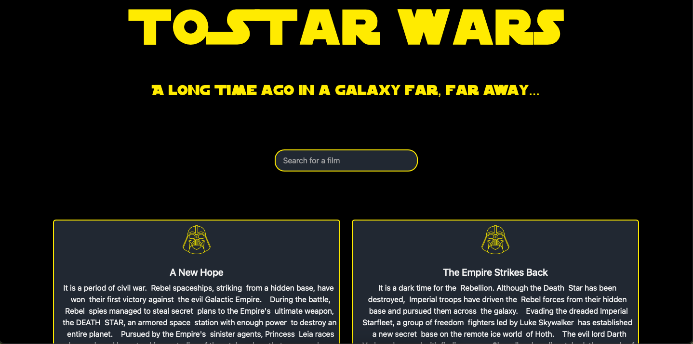
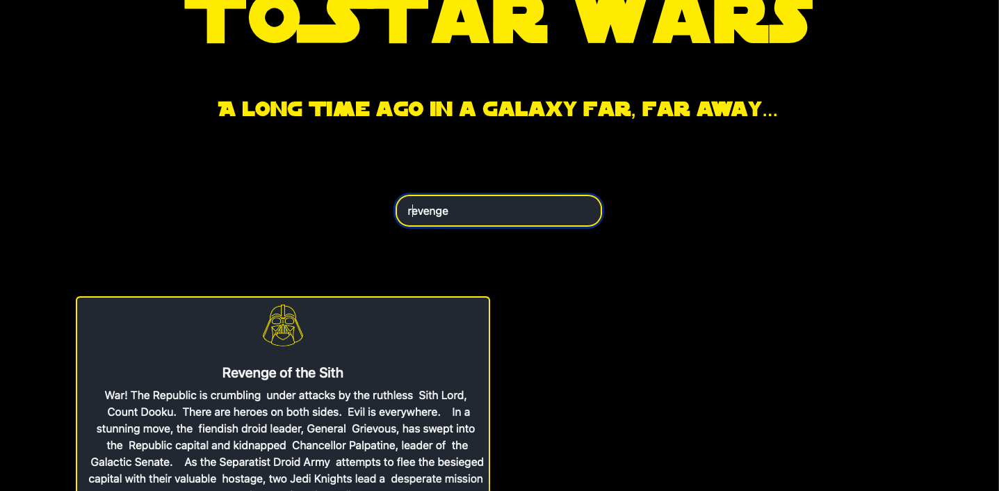

# Frontend Mentor - Blogr landing page solution

This project is created to explore Vue.js and TypeScript, practice working with APIs, and implement keyword search. The project features Star Wars movies. All data is retrieved from the https://swapi.dev/ API. As the API request takes a long time to execute, a preloader has been added.

## Table of contents

- [Overview](#overview)
  - [The challenge](#the-challenge)
  - [Screenshot](#screenshot)
  - [Links](#links)
- [My process](#my-process)
  - [Built with](#built-with)
  - [What I learned](#what-i-learned)

## Overview

### The challenge

Users should be able to:

- View the full list of Star Wars movie series.
- Perform a search by title.

### Screenshot

### Links

- Live Site URL: https://star-wars-vue.netlify.app

## My process

### Built with

- Semantic HTML5 markup
- CSS custom properties
- Flexbox
- CSS Grid
- Mobile-first workflow
- [Vue](https://vuejs.org) - JS library

### What I learned

- Obtaining API data
- Performing a case-sensitive keyword search
- Vue: Project setup, component creation, and export
- TypeScript: Data types and code handling
